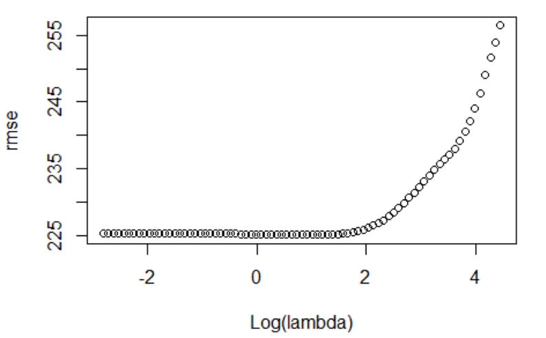
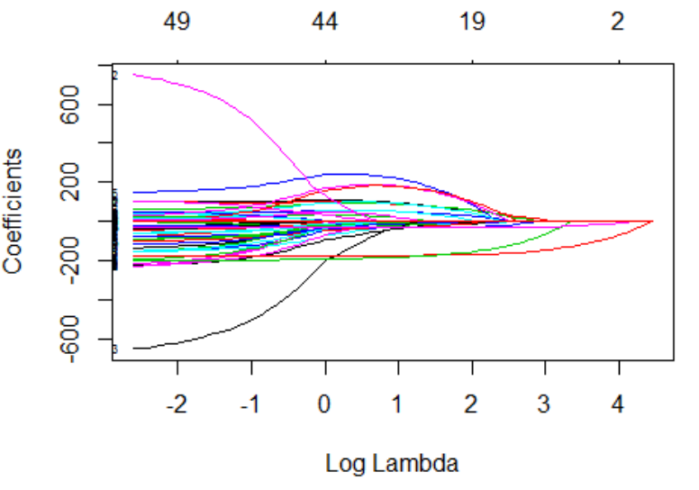
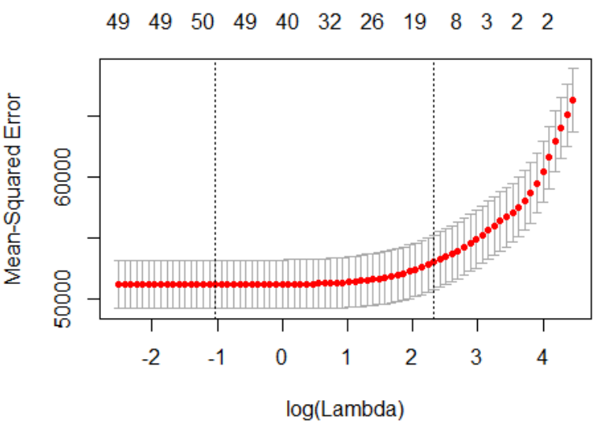
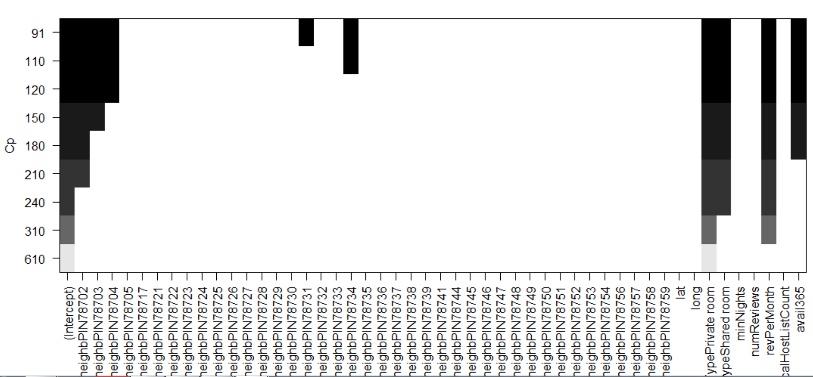
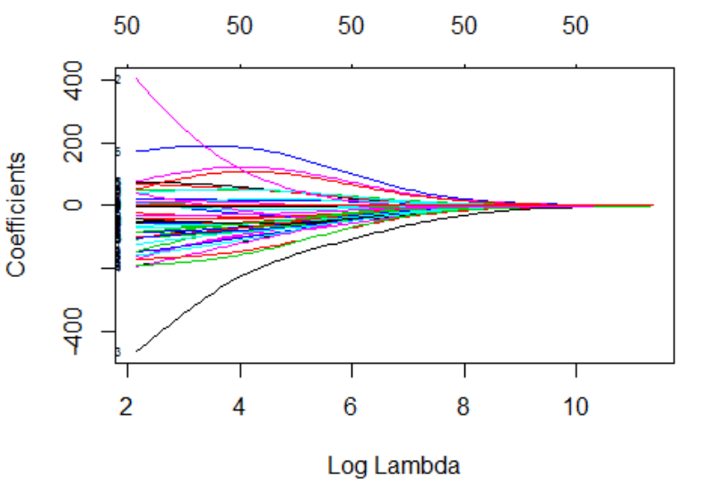
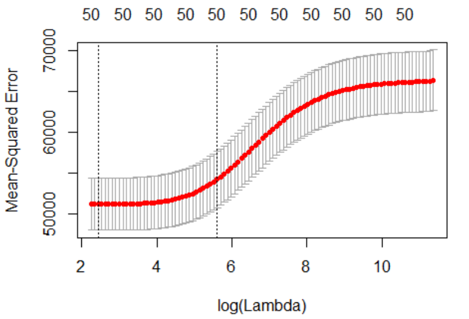
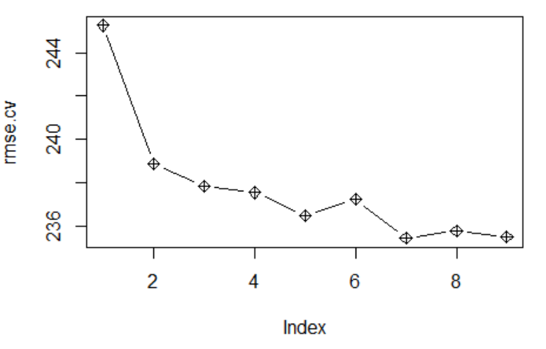
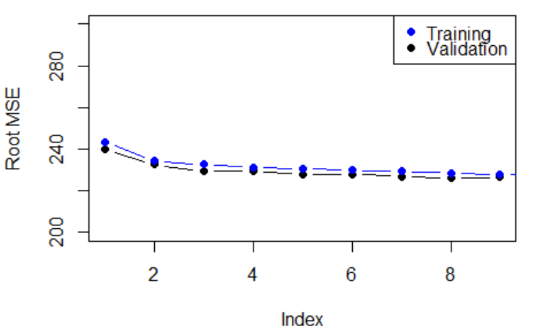

# Airbnb in Austin Part 1

## In this project, I get my feet wet in machine learning, and apply the statistical method on Airbnb data from the Austin area.

## This repo includes:
### 1. Plotting
### 2. Normality Testing
### 3. Removing outliers
### 4. Multiple Linear Regression
### 5. Logistic Regression
### 6. Linear Discriminant Analysis
### 7. Quadratic Discriminant Analysis
### 8. Ridge Regression
### 9. Model Selection
### 10. Stepwise Selection
### 11. Best Subset Selection
### 12. The Lasso Methon
### 13. K Nearest Neighbors
### 14. Validation Error Analysis
### 15. Cross validation

## Here are some pictures from the Analysis:

